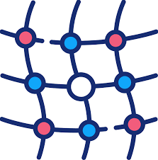

# ChaosMesh in DevOps: Het verbeteren van microservice betrouwbaarheid met behulp van chaos engineering

*[Joost van Ophuizen, oktober 2024.](https://github.com/hanaim-devops/devops-blog-JoostvOphuizen)*

## Wat is ChaosMesh

ChaosMesh is een open-source chaos engineering tool ontworpen voor Kubernetes clusters. Het biedt een platform om verschillende soorten chaos experiments uit te voeren, zoals netwerkvertragingen, pod-fouten en CPU-belasting. Met ChaosMesh testen we de veerkracht van microservices door gecontroleerde storingen te introduceren.

### Architectuur en werking van ChaosMesh

ChaosMesh bestaat uit meerdere componenten: de Chaos Controller Manager, Chaos Daemons en het Chaos Dashboard. De Controller Manager beheert de levenscyclus van chaos experiments en coördineert de uitvoering. Chaos Daemons draaien op elke node en voeren de daadwerkelijke foutinjecties uit. Het Chaos Dashboard biedt een grafische interface voor het beheren en monitoren van experiments.

ChaosMesh maakt gebruik van Custom Resource Definitions (CRDs) om chaos resources te definiëren. Door deze CRDs configureren we specifieke chaos scenarios en passen we ze toe op geselecteerde targets binnen het cluster.

### Gebruik van ChaosMesh in Kubernetes-omgevingen

In een Kubernetes-omgeving integreren we ChaosMesh naadloos door het deployen van de benodigde Kubernetes resources. We definiëren chaos experiments met YAML-manifesten en passen ze toe met `kubectl`. Hierdoor passen we chaos engineering toe binnen bestaande CI/CD-pipelines en DevOps-processen.

Met ChaosMesh simuleren we scenario's zoals netwerkpartities, pod-terminaties en resource-uitputting. Dit helpt bij het identificeren van kwetsbaarheden en het verbeteren van de stabiliteit van microservices in productieomgevingen.

## ChaosMesh binnen het bredere kader van chaos engineering

Chaos engineering is een praktijk waarbij we gecontroleerde experiments uitvoeren om de veerkracht en betrouwbaarheid van systemen te evalueren. We introduceren opzettelijk storingen om te observeren hoe systemen reageren op falen. Dit helpt ons om zwakke punten te identificeren voordat ze problemen veroorzaken in een productieomgeving ([Principles of Chaos Engineering](#bronnen), z.d.).

ChaosMesh is een open-source platform voor chaos engineering, speciaal ontworpen voor Kubernetes clusters. Met ChaosMesh voeren we verschillende soorten foutinjecties uit, zoals netwerkstoringen, pod-crashes en resource-uitputting. Hierdoor testen we de stabiliteit van microservices en verbeteren we de systeembetrouwbaarheid ([Chaos Mesh Overview](#bronnen), z.d.).

Veelvoorkomende experiments met ChaosMesh zijn:

- **Pod Chaos**: We stoppen, verwijderen of herstarten pods om te testen hoe applicaties omgaan met onverwachte uitval.
- **Network Chaos**: We simuleren netwerkproblemen zoals latentie, pakketverlies en netwerkpartitionering om de impact op servicecommunicatie te beoordelen.
- **Stress Chaos**: We belasten systeembronnen zoals CPU en geheugen om te zien hoe applicaties presteren onder resource-schaarste.
- **Filesystem Chaos**: We verstoren bestandssysteemoperaties om de robuustheid van applicaties bij I/O-problemen te testen.
- **Time Chaos**: We manipuleren de systeemklok om te evalueren hoe tijdsafwijkingen applicaties beïnvloeden.

Door deze experiments uit te voeren, verkrijgen DevOps-teams inzicht in het gedrag van systemen onder afwijkende omstandigheden. Dit stelt hen in staat om proactief verbeteringen door te voeren en de algehele betrouwbaarheid van diensten te verhogen ([Chaos Engineering](#bronnen), z.d.).

## Alternatieven voor ChaosMesh

ChaosMesh is een krachtige tool voor chaos engineering in Kubernetes, maar er zijn andere opties beschikbaar. Twee prominente alternatieven zijn **Gremlin** en **LitmusChaos**. Elk van deze tools heeft unieke eigenschappen en kan geschikt zijn afhankelijk van de behoeften van een DevOps-team.

### Gremlin

Gremlin is een commercieel platform voor chaos engineering. Met Gremlin voeren we geavanceerde foutinjecties uit op verschillende infrastructuren, zoals Kubernetes, virtuele machines en bare-metal servers ([Gremlin](#bronnen), z.d.). Gremlin biedt een intuïtieve gebruikersinterface en een uitgebreide bibliotheek van chaos experiments.

Kenmerken van Gremlin:

- **Breed platformbereik**: Ondersteuning voor Kubernetes en andere omgevingen.
- **Gebruiksvriendelijke interface**: Webgebaseerd dashboard voor het configureren en monitoren van experiments.
- **Teambeheer en beveiliging**: Mogelijkheden voor rolgebaseerde toegangscontrole en audit logging.
- **Commerciële ondersteuning**: Toegang tot technische support en expertise.

### LitmusChaos

LitmusChaos is een open-source framework voor chaos engineering in Kubernetes ([LitmusChaos](#bronnen), z.d.). Met LitmusChaos ontwerpen en automatiseren we chaos experiments met behulp van Kubernetes Custom Resource Definitions (CRDs).

Kenmerken van LitmusChaos:

- **Open-source en community-gedreven**: Actieve bijdrage van ontwikkelaars wereldwijd.
- **Naadloze Kubernetes-integratie**: Gebruik van native Kubernetes-objecten voor configuratie.
- **Automatisering**: Integratie met CI/CD-pipelines voor continue testen.
- **Litmus Portal**: Grafische interface voor het beheren en visualiseren van chaos experiments.

### Vergelijking van functionaliteiten en integratie

| Kenmerk                 | ChaosMesh       | Gremlin         | LitmusChaos     |
|-------------------------|-----------------|-----------------|-----------------|
| **Licentiemodel**       | Open-source     | Commercieel     | Open-source     |
| **Platformondersteuning** | Kubernetes     | Meerdere platforms | Kubernetes   |
| **Gebruikersinterface** | Ja (Dashboard)  | Ja (Web UI)     | Ja (Litmus Portal) |
| **Community-ondersteuning** | Actief      | Klantenservice  | Zeer actief     |
| **Integratie met CI/CD** | Ja             | Ja              | Ja              |
| **Soorten experiments** | Uitgebreid      | Uitgebreid      | Uitgebreid      |

### Overwegingen bij de keuze tussen ChaosMesh en alternatieven

Bij het selecteren van een chaos engineering tool overwegen we verschillende factoren:

- **Functionele vereisten**: Welke chaos experiments zijn essentieel voor onze applicaties?
- **Omgevingscompatibiliteit**: Werken we uitsluitend met Kubernetes of ook met andere platforms?
- **Kosten**: Is er budget voor een commerciële tool zoals Gremlin, of geven we de voorkeur aan een open-source oplossing?
- **Gebruiksgemak**: Hoe belangrijk is een intuïtieve interface en eenvoudige implementatie?
- **Ondersteuning en community**: Hebben we behoefte aan commerciële support of vertrouwen we op community-ondersteuning?

**ChaosMesh** is ideaal voor teams die een Kubernetes-specifieke, open-source oplossing zoeken met een eenvoudige installatie en gebruik. **LitmusChaos** biedt vergelijkbare functionaliteiten met extra focus op automatisering en een actieve community. **Gremlin** is geschikt voor organisaties die een professioneel ondersteund platform nodig hebben met brede infrastructuurondersteuning.

## Voordelen en beperkingen van ChaosMesh in productieomgevingen

ChaosMesh biedt voordelen voor het toepassen van chaos engineering in productieomgevingen. Het stelt DevOps-teams in staat om de veerkracht van microservices te testen door gecontroleerde storingen te simuleren. Dit verbetert de voorbereiding op onverwachte incidenten en verhoogt de systeembetrouwbaarheid.

### Analyse van ervaringen uit de praktijk

TODO: herschrijf

### Veelvoorkomende uitdagingen bij het gebruik van ChaosMesh in productie

TODO: herschrijf

### Potentiële risico’s en hoe deze te vermijden

TODO: herschrijf

## Implementatie van ChaosMesh in een Kubernetes-omgeving
- Stappenplan voor het opzetten van ChaosMesh in een Kubernetes-cluster
- Beschrijving van gebruikte tools (bijv. Kind, Linkerd, etc.)
- Resultaten van de uitgevoerde chaos experiments

## Conclusie
- Samenvatting van de belangrijkste bevindingen
- Beantwoording van de hoofdvraag
- Aanbevelingen voor het gebruik van ChaosMesh in DevOps

## Toekomstig onderzoek
- Mogelijke vervolgstappen na dit onderzoek
- Onderwerpen die meer diepgaand kunnen worden onderzocht in verband met ChaosMesh en chaos engineering

## Bronnen
1. [Chaos Engineering. (z.d.). Principles of Chaos Engineering. Geraadpleegd op 7 oktober 2024, van https://principlesofchaos.org/](https://principlesofchaos.org/)
2. [Chaos Mesh Overview. (z.d.). Chaos Mesh Overview. Geraadpleegd op 7 oktober 2024, van https://chaos-mesh.org/docs/](https://chaos-mesh.org/docs/)
3. [Gremlin. (z.d.). Chaos Engineering Platform. Geraadpleegd op 7 oktober 2024, van https://www.gremlin.com/](https://www.gremlin.com/)
4. [LitmusChaos. (z.d.). LitmusChaos Documentation. Geraadpleegd op 7 oktober 2024, van https://litmuschaos.io/](https://litmuschaos.io/)