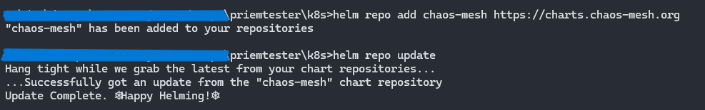
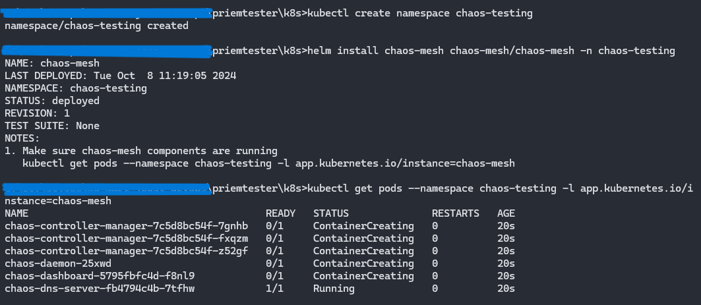
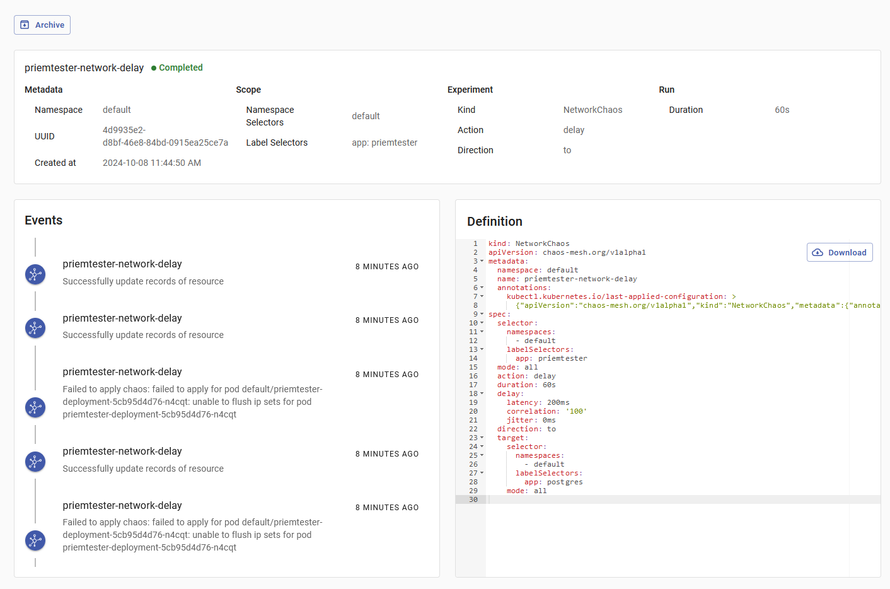

# ChaosMesh in DevOps: Het verbeteren van microservice betrouwbaarheid met behulp van chaos engineering

*[Joost van Ophuizen, oktober 2024.](https://github.com/hanaim-devops/devops-blog-JoostvOphuizen)*
<hr/>

## Wat is ChaosMesh


<!--  -->

ChaosMesh is een open-source chaos engineering tool ontworpen voor Kubernetes clusters. Het stelt ons in staat om verschillende soorten chaos experiments uit te voeren, zoals netwerkvertragingen, pod-fouten en CPU-belasting. Met ChaosMesh testen we de veerkracht van microservices door gecontroleerd storingen te introduceren.

### Architectuur en werking van ChaosMesh

ChaosMesh is gebouwd op Kubernetes Custom Resource Definitions (CRDs). Om verschillende chaos experiments te beheren, definieert ChaosMesh meerdere CRD-types op basis van fouttypen en implementeert het afzonderlijke Controllers voor elk CRD-object. ChaosMesh bestaat uit drie hoofdcomponenten:

- **Chaos Dashboard**: Biedt een webinterface om chaos experiments te beheren en observeren. Het dashboard ondersteunt Role-Based Access Control (RBAC) voor machtigingsbeheer.
- **Chaos Controller Manager**: Verantwoordelijk voor het plannen en beheren van chaos experiments. Het bevat verschillende CRD Controllers, zoals de Workflow Controller en Controllers voor verschillende fouttypen.
- **Chaos Daemon**: Voert de daadwerkelijke foutinjecties uit. De Chaos Daemon draait in DaemonSet-modus en heeft standaard de Privileged permissie. Het verstoort netwerkapparaten, bestandssystemen en kernels door te injecteren in de Namespace van de doel-Pod.

Hieronder zie je de architectuur van ChaosMesh:


De architectuur is onderverdeeld in drie lagen:

1. **Gebruikersinvoer en observatie**: Gebruikersinteracties bereiken de Kubernetes API Server. Alle acties resulteren in een verandering van een Chaos resource, zoals een wijziging in het `NetworkChaos` resource.
2. **Monitoring van resourcewijzigingen en uitvoering van chaos experiments**: De Chaos Controller Manager ontvangt gebeurtenissen van de Kubernetes API Server. Deze beschrijven wijzigingen in Chaos resources, zoals het aanmaken van een nieuw Chaos object.
3. **Injectie van specifieke node-fouten**: De Chaos Daemon accepteert commando's van de Chaos Controller Manager, injecteert in de Namespace van de doel-Pod en voert foutinjecties uit. Voorbeelden zijn het instellen van TC-netwerkregels of het starten van het `stress-ng` proces om CPU- of geheugenbronnen te belasten.

### Sidecar-injectie en IOChaos

In eerdere versies gebruikte ChaosMesh sidecar-containers om I/O-fouten te injecteren. Een sidecar is een extra container die samen met de hoofdcontainer in dezelfde pod draait. Het onderschept en manipuleert I/O-verzoeken om chaos te veroorzaken. De nieuwe IOChaos-implementatie wijzigt de Pod resources niet. Bij het definiëren van een IOChaos experiment wordt voor elke Pod, gefilterd door het `selector` veld, een overeenkomstig `PodIOChaos` resource aangemaakt. Deze aanpak vermindert de complexiteit en verhoogt de efficiëntie van foutinjectie.

### Basisworkflow van ChaosMesh

De workflow van ChaosMesh bestaat uit de volgende stappen:

1. **Definiëren van het chaos experiment**: We schrijven een YAML-bestand dat het gewenste chaos experiment beschrijft.
2. **Appliceren van het experiment**: We sturen het YAML-bestand naar de Kubernetes API Server met `kubectl apply -f`.
3. **Verwerking door de Chaos Controller Manager**: De Controller Manager valideert het experiment en levert het af bij de Chaos Daemon.
4. **Uitvoering van het experiment**: De Chaos Daemon voert de foutinjectie uit op de geselecteerde pods.
5. **Observatie en monitoring**: We monitoren het effect van het experiment via het Chaos Dashboard of andere monitoring tools.

Hieronder een schematische weergave van de workflow:


### Gebruik van ChaosMesh in Kubernetes-omgevingen

In een Kubernetes-omgeving integreren we ChaosMesh door de benodigde resources te deployen. We definiëren chaos experiments met YAML-manifesten en passen ze toe met `kubectl`. Dit stelt ons in staat om chaos engineering te integreren in bestaande CI/CD-pipelines en DevOps-processen.

Met ChaosMesh simuleren we scenario's zoals netwerkpartities, pod-terminaties en resource-uitputting. Door deze experiments uit te voeren, identificeren we kwetsbaarheden en verbeteren we de stabiliteit van microservices in productieomgevingen.

## ChaosMesh binnen het bredere kader van chaos engineering

Chaos engineering is een praktijk waarbij we gecontroleerde experiments uitvoeren om de veerkracht en betrouwbaarheid van systemen te evalueren. We introduceren opzettelijk storingen om te observeren hoe systemen reageren op falen. Dit helpt ons om zwakke punten te identificeren voordat ze problemen veroorzaken in een productieomgeving ([Principles of Chaos Engineering](#bronnen), z.d.).

ChaosMesh is een open-source platform voor chaos engineering, speciaal ontworpen voor Kubernetes clusters. Met ChaosMesh voeren we verschillende soorten foutinjecties uit, zoals netwerkstoringen, pod-crashes en resource-uitputting. Hierdoor testen we de stabiliteit van microservices en verbeteren we de systeembetrouwbaarheid ([Chaos Mesh Overview](#bronnen), z.d.).

Veelvoorkomende experiments met ChaosMesh zijn:

- **Pod Chaos**: We stoppen, verwijderen of herstarten pods om te testen hoe applicaties omgaan met onverwachte uitval.
- **Network Chaos**: We simuleren netwerkproblemen zoals latentie, pakketverlies en netwerkpartitionering om de impact op servicecommunicatie te beoordelen.
- **Stress Chaos**: We belasten systeembronnen zoals CPU en geheugen om te zien hoe applicaties presteren onder resource-schaarste.
- **Filesystem Chaos**: We verstoren bestandssysteemoperaties om de robuustheid van applicaties bij I/O-problemen te testen.
- **Time Chaos**: We manipuleren de systeemklok om te evalueren hoe tijdsafwijkingen applicaties beïnvloeden.

Door deze experiments uit te voeren, verkrijgen DevOps-teams inzicht in het gedrag van systemen onder afwijkende omstandigheden. Dit stelt hen in staat om proactief verbeteringen door te voeren en de algehele betrouwbaarheid van diensten te verhogen ([Chaos Engineering](#bronnen), z.d.).

## Alternatieven voor ChaosMesh

ChaosMesh is een krachtige tool voor chaos engineering in Kubernetes, maar er zijn andere opties beschikbaar. Twee prominente alternatieven zijn **Gremlin** en **LitmusChaos**. Elk van deze tools heeft unieke eigenschappen en kan geschikt zijn afhankelijk van de behoeften van een DevOps-team.

### Gremlin

Gremlin is een commercieel platform voor chaos engineering. Met Gremlin voeren we geavanceerde foutinjecties uit op verschillende infrastructuren, zoals Kubernetes, virtuele machines en bare-metal servers ([Gremlin](#bronnen), z.d.). Gremlin biedt een intuïtieve gebruikersinterface en een uitgebreide bibliotheek van chaos experiments.

Kenmerken van Gremlin:

- **Breed platformbereik**: Ondersteuning voor Kubernetes en andere omgevingen.
- **Gebruiksvriendelijke interface**: Webgebaseerd dashboard voor het configureren en monitoren van experiments.
- **Teambeheer en beveiliging**: Mogelijkheden voor rolgebaseerde toegangscontrole en audit logging.
- **Commerciële ondersteuning**: Toegang tot technische support en expertise.

### LitmusChaos

LitmusChaos is een open-source framework voor chaos engineering in Kubernetes ([LitmusChaos](#bronnen), z.d.). Met LitmusChaos ontwerpen en automatiseren we chaos experiments met behulp van Kubernetes Custom Resource Definitions (CRDs).

Kenmerken van LitmusChaos:

- **Open-source en community-gedreven**: Actieve bijdrage van ontwikkelaars wereldwijd.
- **Naadloze Kubernetes-integratie**: Gebruik van native Kubernetes-objecten voor configuratie.
- **Automatisering**: Integratie met CI/CD-pipelines voor continue testen.
- **Litmus Portal**: Grafische interface voor het beheren en visualiseren van chaos experiments.

### Vergelijking van functionaliteiten en integratie

| Kenmerk                 | ChaosMesh       | Gremlin         | LitmusChaos     |
|-------------------------|-----------------|-----------------|-----------------|
| **Licentiemodel**       | Open-source     | Commercieel     | Open-source     |
| **Platformondersteuning** | Kubernetes     | Meerdere platforms | Kubernetes   |
| **Gebruikersinterface** | Ja (Dashboard)  | Ja (Web UI)     | Ja (Litmus Portal) |
| **Community-ondersteuning** | Actief      | Klantenservice  | Zeer actief     |
| **Integratie met CI/CD** | Ja             | Ja              | Ja              |
| **Soorten experiments** | Uitgebreid      | Uitgebreid      | Uitgebreid      |

### Overwegingen bij de keuze tussen ChaosMesh en alternatieven

Bij het selecteren van een chaos engineering tool overwegen we verschillende factoren:

- **Functionele vereisten**: Welke chaos experiments zijn essentieel voor onze applicaties?
- **Omgevingscompatibiliteit**: Werken we uitsluitend met Kubernetes of ook met andere platforms?
- **Kosten**: Is er budget voor een commerciële tool zoals Gremlin, of geven we de voorkeur aan een open-source oplossing?
- **Gebruiksgemak**: Hoe belangrijk is een intuïtieve interface en eenvoudige implementatie?
- **Ondersteuning en community**: Hebben we behoefte aan commerciële support of vertrouwen we op community-ondersteuning?

**ChaosMesh** is ideaal voor teams die een Kubernetes-specifieke, open-source oplossing zoeken met een eenvoudige installatie en gebruik. **LitmusChaos** biedt vergelijkbare functionaliteiten met extra focus op automatisering en een actieve community. **Gremlin** is geschikt voor organisaties die een professioneel ondersteund platform nodig hebben met brede infrastructuurondersteuning.

## Voordelen en beperkingen van ChaosMesh in productieomgevingen

ChaosMesh biedt voordelen voor het toepassen van chaos engineering in productieomgevingen. Het stelt DevOps-teams in staat om de veerkracht van microservices te testen door gecontroleerd storingen te simuleren. Dit verbetert de voorbereiding op onverwachte incidenten en verhoogt de systeembetrouwbaarheid.

### Analyse van ervaringen uit de praktijk

TODO: herschrijf

### Veelvoorkomende uitdagingen bij het gebruik van ChaosMesh in productie

TODO: herschrijf

### Potentiële risico’s en hoe deze te vermijden

TODO: herschrijf

## Implementatie van ChaosMesh in een Kubernetes-omgeving

### Stappenplan voor het opzetten van ChaosMesh in een Kubernetes-cluster

**Stap 1: Controleer de vereisten**

Zorg voor het volgende:

- **Kubernetes-cluster**: Een draaiend cluster (v1.12 of hoger).
- **kubectl**: Geconfigureerd om verbinding te maken met je cluster.
- **Helm**: Versie 3 of hoger voor het beheren van Kubernetes-charts.

**Stap 2: Installeer Helm**

Ik heb Helm geïnstalleerd via Chocolatey:

```bash
choco install kubernetes-helm
```

Stap 3: Voeg de Chaos Mesh Helm-repository toe

Voeg de officiële Chaos Mesh Helm-repository toe en werk je lokale Helm-repositories bij:

```bash	
helm repo add chaos-mesh https://charts.chaos-mesh.org
helm repo update
```



Stap 4: Installeer Chaos Mesh

Maak een aparte namespace voor Chaos Mesh:

```bash
kubectl create namespace chaos-testing
```



Stap 5: Verifieer de installatie

Controleer of alle pods draaien:

```bash
kubectl get pods -n chaos-testing
```

Je ziet output die aangeeft dat de chaos-controller-manager en chaos-daemon pods draaien.


Stap 6: Open het Chaos Dashboard

Chaos Mesh biedt een dashboard. Open het dashboard met:

```bash
kubectl port-forward -n chaos-testing svc/chaos-dashboard 2333:2333
```

Ga in je webbrowser naar http://localhost:2333.


Uitvoeren van experiments met Chaos Mesh
Pod Kill experiment

Ik heb een Pod Kill experiment gemaakt via het Chaos Dashboard. Dit experiment stopt de geselecteerde pod om te testen hoe de applicatie reageert op uitval.


De YAML-configuratie van het experiment:

```yaml	
apiVersion: chaos-mesh.org/v1alpha1
kind: PodChaos
metadata:
  namespace: default
  name: kill-priemtester
spec:
  selector:
    namespaces:
      - default
    pods:
      default:
        - priemtester-deployment-5cb95d4d76-wgnd2
  mode: all
  action: pod-kill
```

Network Delay experiment

Het tweede experiment simuleert netwerkvertraging tussen de priemtester applicatie en de postgres database.


De YAML-configuratie van het experiment:

```yaml
apiVersion: chaos-mesh.org/v1alpha1
kind: NetworkChaos
metadata:
  name: priemtester-network-delay
  namespace: default
spec:
  action: delay
  mode: all
  selector:
    labelSelectors:
      app: priemtester
  delay:
    latency: '200ms'
    correlation: '100'
  direction: to
  target:
    mode: all
    selector:
      labelSelectors:
        app: postgres
  duration: '60s'
```

Tijdens dit experiment heb ik een Postman-request uitgevoerd naar de priemtester applicatie. Door de vertraging duurde het langer om een respons te ontvangen.

Conclusie van de experiments

Door deze experiments uit te voeren, kreeg ik inzicht in hoe de applicatie omgaat met pod-uitval en netwerkvertraging. Het Pod Kill experiment liet zien dat de applicatie de pod automatisch opnieuw startte, wat aangeeft dat er redundantie is. Het Network Delay experiment toonde aan dat de applicatie vertraagde responsen gaf, wat invloed heeft op de gebruikerservaring.

Deze tests benadrukken het belang van chaos engineering bij het identificeren van zwakke punten en het verbeteren van de betrouwbaarheid van microservices in een Kubernetes-omgeving.

## Conclusie
- Samenvatting van de belangrijkste bevindingen
- Beantwoording van de hoofdvraag
- Aanbevelingen voor het gebruik van ChaosMesh in DevOps

## Toekomstig onderzoek
- Mogelijke vervolgstappen na dit onderzoek
- Onderwerpen die meer diepgaand kunnen worden onderzocht in verband met ChaosMesh en chaos engineering

## Bronnen
1. [Chaos Engineering. (z.d.). Principles of Chaos Engineering. Geraadpleegd op 7 oktober 2024, van https://principlesofchaos.org/](https://principlesofchaos.org/)
2. [Chaos Mesh Overview. (z.d.). Chaos Mesh Overview. Geraadpleegd op 7 oktober 2024, van https://chaos-mesh.org/docs/](https://chaos-mesh.org/docs/)
3. [Gremlin. (z.d.). Chaos Engineering Platform. Geraadpleegd op 7 oktober 2024, van https://www.gremlin.com/](https://www.gremlin.com/)
4. [LitmusChaos. (z.d.). LitmusChaos Documentation. Geraadpleegd op 7 oktober 2024, van https://litmuschaos.io/](https://litmuschaos.io/)
5. [Casey, K. (2020). *How to explain Kubernetes in plain English*. Geraadpleegd op 7 oktober 2024, van https://enterprisersproject.com/article/2017/10/how-explain-kubernetes-plain-english](https://enterprisersproject.com/article/2017/10/how-explain-kubernetes-plain-english)
6. [Chaos Mesh. (z.d.). *Architecture Overview*. Geraadpleegd op 7 oktober 2024, van https://chaos-mesh.org/docs](https://chaos-mesh.org/docs/#:~:text=Architecture%20overview%E2%80%8B,or%20memory%20resource.)
7. [Chaos Mesh. (z.d.). *Implement Chaos Engineering in K8s*. Geraadpleegd op 7 oktober 2024, van https://chaos-mesh.org/blog/implement-chaos-engineering-in-k8s/](https://chaos-mesh.org/blog/implement-chaos-engineering-in-k8s/)